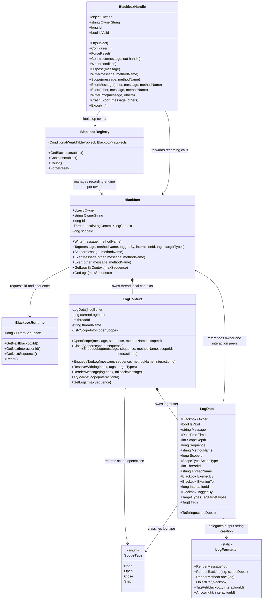

# Blackbox Object Diagram

This diagram shows the objects and relationships that participate in Blackbox's core recording paths.

---

## Items Excluded from the Diagram

For readability, handle-related auxiliary structures such as `TagHandle`, `ScopeHandle`, `ExertHandle`, and `HandleManager<T>` are excluded from this diagram. Target recording connected by `.With(...)` is handled as a flow where `LogContext.ResolveWith(...)` fixes the source log's tag list, then `Blackbox.Tag(...)` adds a target-side tag log.
