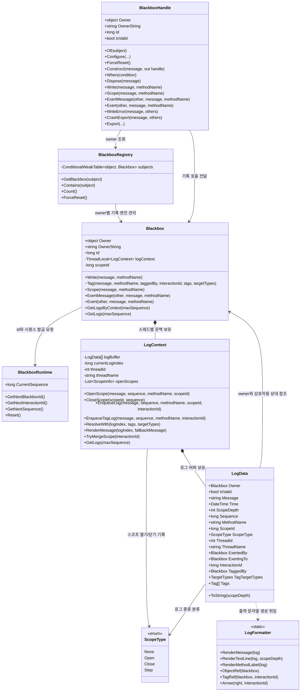

# Blackbox 객체 다이어그램

이 다이어그램은 Blackbox의 핵심 기록 경로에 참여하는 객체와 관계를 보여준다.

---

## 다이어그램 제외 항목

가독성을 위해 `TagHandle`, `ScopeHandle`, `ExertHandle`, `HandleManager<T>` 같은 핸들 계열 보조 구조는 이 다이어그램에서 제외한다. `.With(...)`로 연결한 대상 기록은 `LogContext.ResolveWith(...)`가 원본 로그의 태그 목록을 확정한 뒤, `Blackbox.Tag(...)`를 통해 대상 쪽 태그 로그를 추가하는 흐름으로 처리한다.
