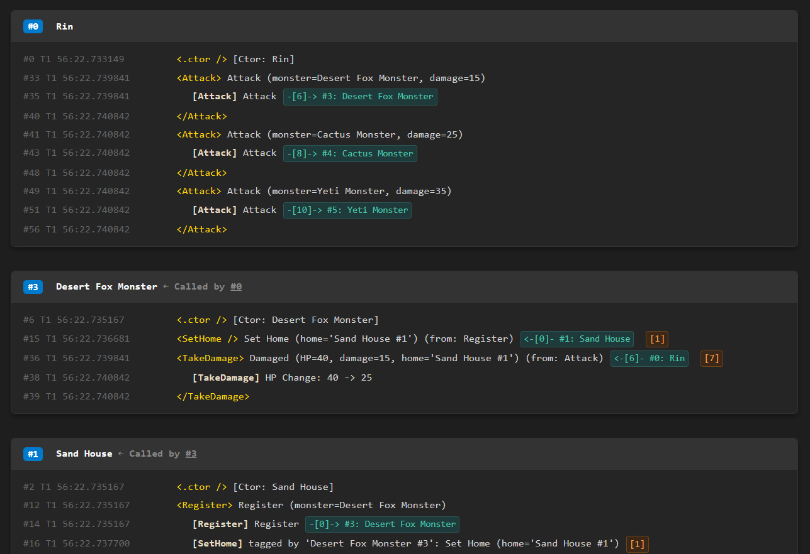

# Blackbox System

[English README](README.md)

Blackbox는 객체별 활동, 실행 스코프, 객체 간 상호작용을 기록하고 나중에 연결된 로그로 다시 읽기 위한 Unity/C# 추적 프레임워크이다.

일반 로그가 한 시점의 메시지를 남기는 데 집중한다면, Blackbox는 '이 객체가 어떤 과정을 거쳤는가'와 '그 과정에서 어떤 객체와 연결되었는가'를 함께 남긴다.



---

## 시작하기 전에

Blackbox는 BlackThunder 프로젝트군의 기반 추적 프레임워크입니다.

이 저장소는 dove-creative가 공개하는 초기 오픈소스 프로젝트입니다. 사용 중 불편한 점이나 개선할 부분을 발견하시면 Discussion을 열어 주시거나 vkdl4062@gmail.com으로 알려 주시면 도움이 됩니다.

Blackbox를 사용해 주셔서 감사합니다.

---

## 주요 기능

- 객체별 로그 저장소: 대상 객체마다 대응되는 `Blackbox`를 만들고, 실행 중 로그를 누적한다.
- 스코프 기록: `Scope(...)`와 `using`으로 처리 구간의 시작과 끝을 함께 남긴다.
- 상호작용 기록: `Exert(...)`와 `ExertMessage(...)`로 객체 간 호출 관계를 양쪽 로그에 기록한다.
- 태그 연결: `Write(...).With(...)`나 `Scope(...).With(...)`로 원본 로그에 관련 대상을 붙인다.
- 출력: 기록된 로그를 텍스트 또는 HTML 파일로 내보낸다.
- 런타임 스위치: `BlackboxHandle.UseBlackbox`로 기록 핸들 생성과 로그 저장 여부를 제어한다.

---

## 설치

Blackbox는 Unity 프로젝트에서는 Unity 패키지로 사용할 수 있고, 네이티브 C# 프로젝트에서는 런타임 소스를 직접 포함해 사용할 수 있다.

### Unity에서 사용

Unity에서는 Package Manager 설치와 폴더형 패키지 설치를 모두 사용할 수 있다.

#### Package Manager로 설치

1. Unity에서 `Window > Package Manager`를 연다.
2. 왼쪽 위 `+` 버튼을 누른 뒤 `Add package from git URL...`을 선택한다.
3. 아래 URL을 입력하고 `Add`를 누른다.

```text
https://github.com/dove-creative/blackbox-system.git
```

#### 폴더로 직접 설치

1. 이 폴더를 Unity 프로젝트의 `Packages/com.blackthunder.blackboxsystem` 위치에 둔다.

#### 설치 후 설정

1. 실행 초기에 로그 출력 위치를 설정한다.

```csharp
BlackboxHandle.Configure(
	logDirectory: Path.Combine(Application.persistentDataPath, "BlackboxLogs"),
	logger: Debug.Log);
```

Unity에서 `BLACKBOX` 심볼은 `BlackboxHandle.UseBlackbox`의 시작 기본값만 정한다. 심볼 유무와 관계없이 동일한 런타임 API를 사용하며, 이 심볼이 없으면 Unity는 기록이 꺼진 상태에서 시작한다. 기록을 활성화하려면 Player Settings의 Scripting Define Symbols에 `BLACKBOX`를 추가하거나, 실행 초기에 `BlackboxHandle.UseBlackbox = true`를 설정한다.

기록을 일시적으로 멈추고 싶다면 `BlackboxHandle.UseBlackbox = false`를 설정하거나 `Configure(..., useBlackbox: UseBlackboxOption.DoNotUse)`를 사용한다. 이 런타임 스위치가 꺼져 있으면 `BlackboxHandle.Of(subject)`는 유효하지 않은 핸들을 반환하고, 기록 호출은 no-op 또는 기본값 반환으로 빠진다.

### 네이티브 C#에서 사용

현재 별도 NuGet 패키지는 제공하지 않는다. 네이티브 C# 프로젝트에서는 이 패키지 폴더를 소스 의존성으로 두고, `Runtime/**/*.cs` 파일을 컴파일에 포함한다.

```xml
<ItemGroup>
  <Compile
    Include="path/to/com.blackthunder.blackboxsystem/Runtime/**/*.cs"
    LinkBase="Blackbox/Runtime" />
</ItemGroup>
```

실행 초기에 로그 출력 위치와 로거를 설정한다.

```csharp
BlackboxHandle.Configure(
	logDirectory: Path.Combine(AppContext.BaseDirectory, "BlackboxLogs"),
	logger: Console.WriteLine);
```

네이티브 C#에서는 Unity 전용 `BLACKBOX` 심볼을 사용하지 않으므로 기본 기록 상태가 켜져 있다. 실행 중 기록을 멈추고 싶다면 `BlackboxHandle.UseBlackbox = false`를 설정하거나 `Configure(..., useBlackbox: UseBlackboxOption.DoNotUse)`를 사용한다.

---

## 빠른 시작

### 기본 사용 코드

```csharp
using BlackThunder.BlackboxSystem;

public class Loader
{
    public Loader()
    {
        BlackboxHandle.Of(this).Construct("Loader");
    }

    public void Load(Worker worker)
    {
        using var _ = BlackboxHandle.Of(this).Scope("Load");

        BlackboxHandle.Of(this).Write("Prepare %0").With(worker);

        using (BlackboxHandle.Of(this).Exert(worker, "Worker.Load"))
		worker.Load();
    }

    public void ExportLogs()
    {
        BlackboxHandle.Of(this).Export();
    }
}
```

이 예시는 다음 정보를 남긴다.

- `Loader` 객체의 `Load` 스코프
- 스코프 시작 로그
- `worker.Load()` 호출에 대한 양쪽 상호작용 기록
- `ExportLogs()` 호출 시 `Loader`를 중심으로 연결된 로그 출력

### Unity 샘플 실행

Unity Package Manager의 `Samples`에서 `Unity Usage`를 import한 뒤 `BlackboxUsageSample` 씬을 연다. 실행 후 화면의 버튼으로 `Write`, `Exert`, `Tag`, `Exception` 샘플을 각각 실행할 수 있다.

### 네이티브 C# 샘플 실행

네이티브 C#에서는 `Samples~/NativeCSharp` 콘솔 샘플을 실행해 Unity API 없이 같은 기록 흐름을 확인할 수 있다.

```powershell
cd Samples~/NativeCSharp
dotnet run --project Blackbox.NativeCSharp.Samples.csproj
```

실행 후 `sample>` 프롬프트에서 `write`, `exert`, `tag`, `exception` 중 하나를 입력한다. 빈 입력은 다시 입력을 기다리고, `exit`를 입력하면 종료한다.

네이티브 샘플은 기본값인 `UseBlackbox = true` 상태로 실행된다. 로그는 샘플 앱 출력 폴더의 `BlackboxSystem/Samples/NativeCSharp` 아래에 시나리오별로 생성된다.

---

## 주요 API

- `BlackboxHandle.Of(subject)`: 대상 객체의 기록 진입점을 얻는다.
- `Write(message)`: 한 줄 활동 로그를 남긴다.
- `Write(message).With(targets)`: 활동 로그에 관련 대상을 붙인다.
- `Scope(message)`: 스코프 시작 로그를 남기고 `ScopeHandle`을 반환한다.
- `Scope(message).With(targets)`: 스코프 시작 로그에 관련 대상을 붙인다.
- `Exert(other, message)`: 다른 객체와의 상호작용을 남기고, 받는 쪽 스코프 병합을 시도할 `ExertHandle`을 반환한다.
- `ExertMessage(other, message)`: 병합 없이 한 줄 상호작용 기록만 남긴다.
- `WriteError(message)`: 오류 메시지를 로그로 남기고 같은 문자열을 반환한다.
- `Export(...)`: 현재 객체를 중심으로 로그 파일을 출력한다.
- `CrashExport(...)`: 오류 기록과 출력 생성을 함께 수행한다.
- `ForceReset()`: 테스트나 반복 실험용 초기화 지점에서 내부 상태를 비운다.

---

## 문서

자세한 설명은 `Documentation~/Wiki.ko` 폴더에 있다.

- [01-Overview.md](Documentation~/Wiki.ko/01-Overview.md): 기능의 목적과 큰 흐름
- [02-Implementations.md](Documentation~/Wiki.ko/02-Implementations.md): 전체 구현 구조
- [02.1-Tag-Flow.md](Documentation~/Wiki.ko/02.1-Tag-Flow.md): 태그 연결 흐름
- [02.2-Export-Pipeline.md](Documentation~/Wiki.ko/02.2-Export-Pipeline.md): 출력 파이프라인
- [02.3-Handle-Lifecycle.md](Documentation~/Wiki.ko/02.3-Handle-Lifecycle.md): 핸들 생명주기
- [03-Object-Diagram.md](Documentation~/Wiki.ko/03-Object-Diagram.md): 객체 관계 다이어그램
- [04-Usage.md](Documentation~/Wiki.ko/04-Usage.md): 사용 예시와 호출 기준

영어 문서는 `Documentation~/Wiki.en` 폴더에 있다.

---

## 테스트

테스트 코드는 `Tests` 폴더에 있으며, Unity Test Framework와 NUnit을 사용한다.

Unity에서 테스트를 실행하려면 `BLACKBOX_TESTS`, `UNITY_INCLUDE_TESTS` 심볼이 활성화된 Editor 테스트 환경을 사용한다. Unity에서 `UseBlackbox` 시작 기본값도 함께 켜려면 `BLACKBOX` 심볼을 추가한다. 패키지 형태로 분리해 사용하는 경우, Unity 프로젝트의 testables 설정이나 테스트 asmdef 설정도 함께 확인한다.

---

## 라이선스

Blackbox는 MIT 라이선스로 배포된다. 자세한 내용은 [LICENSE.md](LICENSE.md)를 참고한다.
