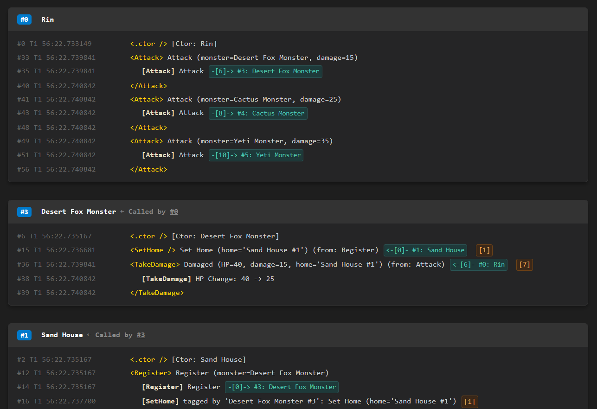

# Blackbox System

[English README](README.md)

Blackbox는 객체별 활동, 실행 스코프, 객체 간 상호작용을 기록하고 나중에 연결된 로그로 다시 읽기 위한 .NET 추적 프레임워크이다.

일반 로그가 한 시점의 메시지를 남기는 데 집중한다면, Blackbox는 '이 객체가 어떤 과정을 거쳤는가'와 '그 과정에서 어떤 객체와 연결되었는가'를 함께 남긴다.



## 시작하기 전에

Blackbox는 BlackThunder 프로젝트군의 기반 추적 프레임워크입니다.

이 저장소는 dove-creative가 공개하는 초기 오픈소스 프로젝트입니다. 사용 중 불편한 점이나 개선할 부분을 발견하시면 Discussion을 열어 주시거나 vkdl4062@gmail.com으로 알려 주시면 도움이 됩니다.

Blackbox를 사용해 주셔서 감사합니다.

## 주요 기능

- 객체별 로그 저장소: 대상 객체마다 대응되는 `Blackbox`를 만들고, 실행 중 로그를 누적한다.
- 스코프 기록: `Scope(...)`와 `using`으로 처리 구간의 시작과 끝을 함께 남긴다.
- 상호작용 기록: `Exert(...)`와 `ExertMessage(...)`로 객체 간 호출 관계를 양쪽 로그에 기록한다.
- 태그 연결: `Write(...).With(...)`나 `Scope(...).With(...)`로 원본 로그에 관련 대상을 붙인다.
- 출력: 기록된 로그를 텍스트 또는 HTML 파일로 내보낸다.
- 런타임 스위치: `BlackboxHandle.UseBlackbox`로 기록 핸들 생성과 로그 저장 여부를 제어한다.

## 설치

현재 별도 NuGet 패키지는 제공하지 않는다. 이 저장소를 로컬 의존성이나 서브모듈로 둔 뒤 라이브러리 프로젝트를 참조한다.

```xml
<ItemGroup>
  <ProjectReference Include="path/to/blackbox-system/src/BlackThunder.BlackboxSystem/BlackThunder.BlackboxSystem.csproj" />
</ItemGroup>
```

실행 초기에 로그 출력 위치와 로거를 설정한다.

```csharp
BlackboxHandle.Configure(
	logDirectory: Path.Combine(AppContext.BaseDirectory, "BlackboxLogs"),
	logger: Console.WriteLine);
```

기본 기록 상태는 켜져 있다. 실행 중 기록을 멈추고 싶다면 `BlackboxHandle.UseBlackbox = false`를 설정하거나 `Configure(..., useBlackbox: UseBlackboxOption.DoNotUse)`를 사용한다. 이 런타임 스위치가 꺼져 있으면 `BlackboxHandle.Of(subject)`는 유효하지 않은 핸들을 반환하고, 기록 호출은 no-op 또는 기본값 반환으로 빠진다.

## 빠른 시작

### 기본 사용 코드

```csharp
using BlackThunder.BlackboxSystem;

public class Loader
{
    public Loader()
    {
        BlackboxHandle.Of(this).Construct("Loader");
    }

    public void Load(Worker worker)
    {
        using var _ = BlackboxHandle.Of(this).Scope("Load");

        BlackboxHandle.Of(this).Write("Prepare %0").With(worker);

        using (BlackboxHandle.Of(this).Exert(worker, "Worker.Load"))
		worker.Load();
    }

    public void ExportLogs()
    {
        BlackboxHandle.Of(this).Export();
    }
}
```

이 예시는 다음 정보를 남긴다.

- `Loader` 객체의 `Load` 스코프
- 스코프 시작 로그
- `worker.Load()` 호출에 대한 양쪽 상호작용 기록
- `ExportLogs()` 호출 시 `Loader`를 중심으로 연결된 로그 출력

### C# 샘플 실행

`samples/Blackbox.NativeCSharp.Samples` 콘솔 샘플에서 기록 흐름을 확인할 수 있다.

```powershell
dotnet run --project samples/Blackbox.NativeCSharp.Samples/Blackbox.NativeCSharp.Samples.csproj
```

실행 후 `sample>` 프롬프트에서 `write`, `exert`, `tag`, `exception` 중 하나를 입력한다. 빈 입력은 다시 입력을 기다리고, `exit`를 입력하면 종료한다.

네이티브 샘플은 기본값인 `UseBlackbox = true` 상태로 실행된다. 로그는 샘플 앱 출력 폴더의 `BlackboxSystem/Samples/NativeCSharp` 아래에 시나리오별로 생성된다.

## 주요 API

- `BlackboxHandle.Of(subject)`: 대상 객체의 기록 진입점을 얻는다.
- `Write(message)`: 한 줄 활동 로그를 남긴다.
- `Write(message).With(targets)`: 활동 로그에 관련 대상을 붙인다.
- `Scope(message)`: 스코프 시작 로그를 남기고 `ScopeHandle`을 반환한다.
- `Scope(message).With(targets)`: 스코프 시작 로그에 관련 대상을 붙인다.
- `Exert(other, message)`: 다른 객체와의 상호작용을 남기고, 받는 쪽 스코프 병합을 시도할 `ExertHandle`을 반환한다.
- `ExertMessage(other, message)`: 병합 없이 한 줄 상호작용 기록만 남긴다.
- `WriteError(message)`: 오류 메시지를 로그로 남기고 같은 문자열을 반환한다.
- `Export(...)`: 현재 객체를 중심으로 로그 파일을 출력한다.
- `CrashExport(...)`: 오류 기록과 출력 생성을 함께 수행한다.
- `ForceReset()`: 테스트나 반복 실험용 초기화 지점에서 내부 상태를 비운다.

## 문서

자세한 설명은 `docs/Wiki.ko` 폴더에 있다.

- [01-Overview.md](docs/Wiki.ko/01-Overview.md): 기능의 목적과 큰 흐름
- [02-Implementations.md](docs/Wiki.ko/02-Implementations.md): 전체 구현 구조
- [02.1-Tag-Flow.md](docs/Wiki.ko/02.1-Tag-Flow.md): 태그 연결 흐름
- [02.2-Export-Pipeline.md](docs/Wiki.ko/02.2-Export-Pipeline.md): 출력 파이프라인
- [02.3-Handle-Lifecycle.md](docs/Wiki.ko/02.3-Handle-Lifecycle.md): 핸들 생명주기
- [03-Object-Diagram.md](docs/Wiki.ko/03-Object-Diagram.md): 객체 관계 다이어그램
- [04-Usage.md](docs/Wiki.ko/04-Usage.md): 사용 예시와 호출 기준

영어 문서는 `docs/Wiki.en` 폴더에 있다.

## 테스트

테스트 코드는 `tests/BlackThunder.BlackboxSystem.Tests`에 있으며 NUnit을 사용한다.

테스트 프로젝트는 컴파일 심볼이 양쪽 코드에 동일하게 적용되도록 Blackbox 런타임과 형제 UniTest 런타임 소스를 링크한다.

```powershell
dotnet test tests/BlackThunder.BlackboxSystem.Tests/BlackThunder.BlackboxSystem.Tests.csproj
```

테스트 계획 문서는 `docs/Tests.ko` 폴더에 있으며, 영어 문서는 `docs/Tests.en` 폴더에 있다.

## 라이선스

Blackbox는 MIT 라이선스로 배포된다. 자세한 내용은 [LICENSE.md](LICENSE.md)를 참고한다.
